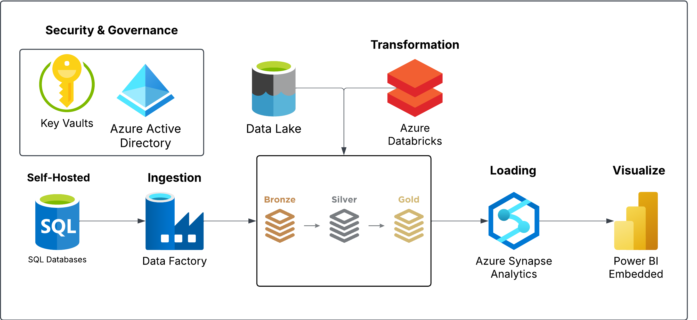
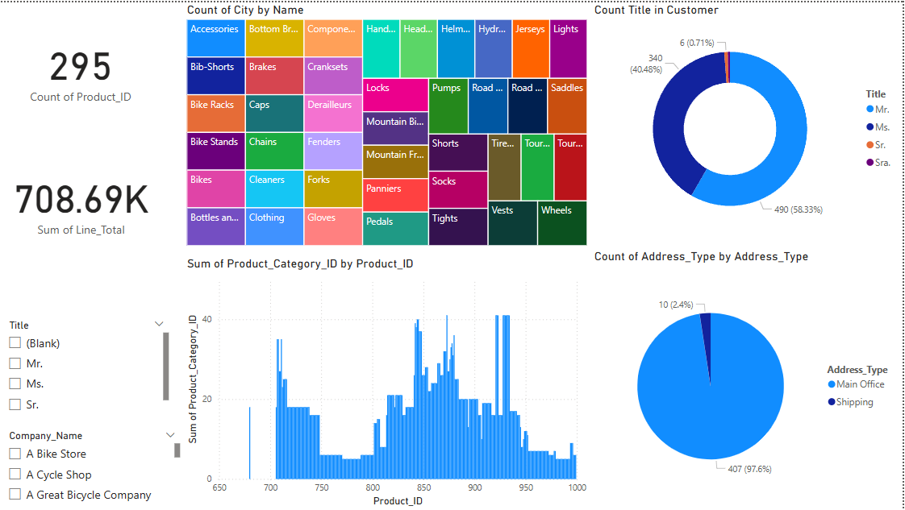

# A Complete Real-Time End-to-End Azure Data Engineering AdventureWorks Sales Data Analytics
## Project Overview
This project aims to build a complete end-to-end data platform using Microsoft Azure services. The process includes data ingestion, transformation, loading, and reporting, demonstrating a real-time data engineering workflow.

## Tools and Technologies Used
- **Azure Data Factory** (ADF) - For data ingestion and pipeline orchestration.
- **Azure Data Lake Storage Gen2** - For storing raw and transformed data.
- **Azure Databricks** - For data transformation and cleansing.
- **Azure Synapse Analytics** - For data warehousing and efficient querying.
- **Azure Key Vault** - For securely storing credentials and secrets.
- **Azure Active Directory (AAD)** - For authentication and access control.
- **Microsoft Power BI** - For interactive data visualization and reporting.

## Use Case
This project involves building an end-to-end data engineering pipeline by ingesting tables from an **on-premises SQL Server database** using **Azure Data Factory (ADF)**. The ingested data is stored in **Azure Data Lake Storage Gen2**. Then, **Azure Databricks** is used to clean and transform the raw data into its most refined form. The processed data is loaded into **Azure Synapse Analytics**, and finally, **Microsoft Power BI** is used to build an interactive dashboard. **Azure Active Directory (AAD)** and **Azure Key Vault** are integrated for security, monitoring, and governance.

## Project Workflow
1. **Environment Setup**
   - Create an **Azure Key Vault** to securely store SQL Server credentials.
   - Deploy **Azure Data Factory (ADF)** for data ingestion.
   - Set up **Self-Hosted Integration Runtime (SHIR)** to connect to on-prem SQL Server.
   - Use the **Copy Activity** in ADF to ingest data into **Azure Data Lake Storage Gen2**.

2. **Data Transformation using Azure Databricks**
   - Use **Databricks Notebooks** to clean and process raw data.
   - Perform **data modeling** and prepare data for analysis.
   
3. **Data Loading using Azure Synapse Analytics**
   - Load transformed data into **Azure Synapse Analytics** for querying and reporting.
   - Establish **linked services** for efficient data movement.

4. **Data Reporting using Microsoft Power BI**
   - Connect **Power BI** to Azure Synapse Analytics.
   - Build an **interactive dashboard** to visualize insights.

5. **Security and Governance**
   - Use **Azure Active Directory (AAD)** to manage access.
   - Implement **monitoring and governance** using **Azure Key Vault**.

6. **End-to-End Pipeline Testing**
   - Execute the **data pipeline** to ensure proper data flow.
   - Validate data transformations and report updates in Power BI.
   - Implement **scheduled triggers** for automated execution.
  
## Conclusion

- Improved Data Accessibility: Sales teams and decision-makers now have access to clean, structured, and up-to-date data, improving decision-making processes.
- Real-Time Insights: With the automated pipeline and Power BI integration, data updates are reflected dynamically, allowing for faster response times to market changes.
- Enhanced Data Security & Compliance: Using Azure Key Vault and AAD, the system ensures that sensitive information is securely stored and accessed only by authorized users.
- Cost & Resource Management: The project emphasizes monitoring and resource cleanup after execution to avoid over-billing, ensuring efficient cloud cost management.

